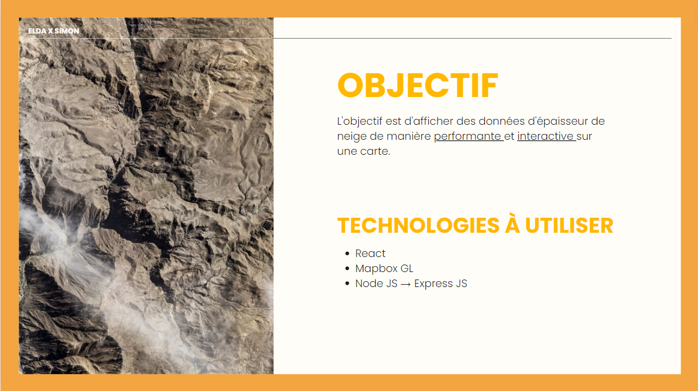
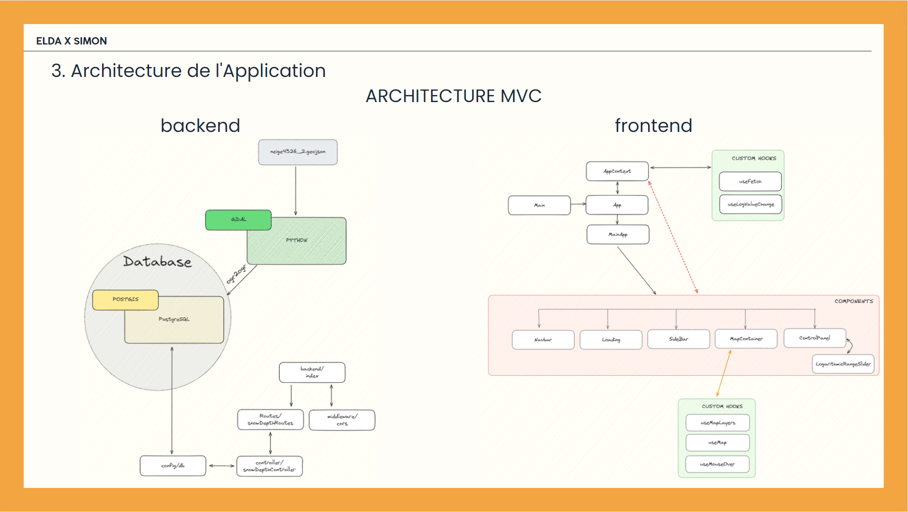

# ELDA TECHNOLOGY x Simon 🌍

## Introduction

 👨🏻‍💻 Il s'agit d'un projet de test technique pour ma candidature au poste de développeur Web Full Stack chez [ELDA TECHNOLOGY](https://eldatechnology.fr/).

---

## Presentation 🎆

---

## Objectif 📍

## Architecture 🛠️

---

## Réalisation du projet

### Documentation 📄

[Documentation sur Canva](https://www.canva.com/design/DAGJ-dznxHg/VqY6-I7rnbLK7Puf0utVyQ/edit?utm_content=DAGJ-dznxHg&utm_campaign=designshare&utm_medium=link2&utm_source=sharebutton)

---

### Présentation 👀

---

# Detail de la mission

## 📄 Description du projet

Votre mission sera de développer une petite application web SIG simple utilisant React et Mapbox GL JS, node JS/express JS.

L'objectif est d'afficher des données d'épaisseur de neige de manière performante et interactive sur une carte.

## 🔬Technologies à utiliser

- React
- Mapbox GL
- Node JS → Express JS

## 🏭 Données fournies

Vous trouverez un jeu de données contenant un fichier **GeoTIFF (.tif)** et **.GeoJson** représentant l'épaisseur de neige (ce sont les mêmes données, juste des formats différents).

Attention sur le système de coordonnées des fichiers, pour le .tif il s'agit de epsg:3945 (zone de serre chevalier) et le geojson c'est epsg:4326.

## 🛠️ Fonctionnalités attendues

1. Afficher les données d'épaisseur de neige sur une carte interactive.
2. Permettre l'affichage des épaisseurs de neige en cliquant sur la carte ou en survolant (hover).
3. Filtrer les données par valeurs d’épaisseur de neige
4. Appliquer différents styles de couleurs facilement pour représenter les épaisseurs de neige.
5. Le choix de la méthode d'affichage (rastertiles, vectortiles, ou autre) est libre, cependant l'utilisation de services WMS ou WFS via GeoServer ou similaires est interdite.
    - L'utilisation de Postgresql et Postgis est autorisé.

## 📦 Livrables

1. Code source complet de l'application déposé sur un dépôt GitHub
2. Documentation détaillant :
    - La stratégie adoptée pour le développement de l'application.
    - Le workflow mis en place pour traiter et afficher les données.
    - Toute autre information pertinente sur les choix techniques effectués.

## 🗒️ Critères d'évaluation

Nous évaluerons ton projet sur les critères suivants :

1. Performance et interactivité de l'application.
2. Qualité et clarté du code.
3. Justesse et précision des explications fournies dans la documentation.
4. Respect des délais et des consignes données.

## ⏲️ Délai

Tu as une semaine à compter de la réception de ce mail pour compléter ce projet. La date limite de soumission est le 05/07/2024 minuit.
